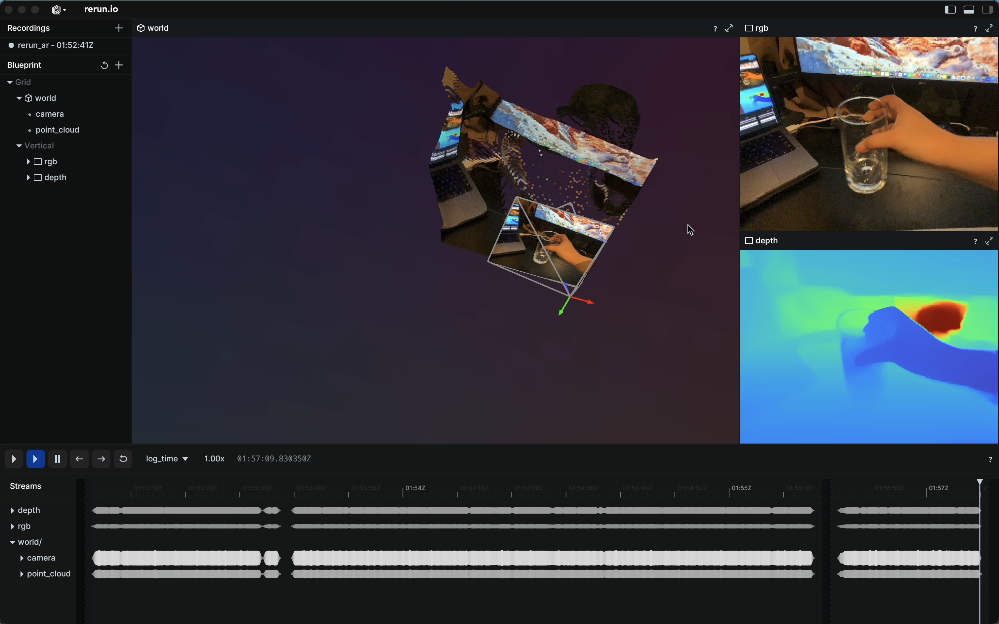

This example provides example code for connecting rerun with Unity3D [ARFoundation 5.1](https://docs.unity3d.com/Packages/com.unity.xr.arfoundation@5.1/manual/index.html) for visualizing camera RGB, depth and pose in real-time.
Inside this codebase, we provide an Unity3D client for capturing and streaming ARKit camera data, and a Python-based gRPC server for receiving and logging the device data on rerun.

Note: current version only works with iOS (ARKit)-based devices.

```bash
pip install -r examples/python/arfoundation/requirements.txt
python examples/python/arfoundation/main.py
```
