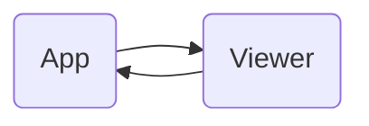

<!--[metadata]
title = "Custom Viewer Callback"
thumbnail = "https://static.rerun.io/custom_callback/1434da408fd59ea1349169784b47d8ffc285022e/480w.png"
thumbnail_dimensions = [480, 291]
-->

Example showing how to control an app with the Rerun viewer, by extending the viewer UI.

The example builds on the [`extend_viewer_ui`](../extend_viewer_ui/) example, but is still rather basic.

## Architecture

<picture>
  
  <source media="(max-width: 480px)" srcset="https://static.rerun.io/custom_callback/1434da408fd59ea1349169784b47d8ffc285022e/480w.png">
  <source media="(max-width: 768px)" srcset="https://static.rerun.io/custom_callback/1434da408fd59ea1349169784b47d8ffc285022e/768w.png">
  <source media="(max-width: 1024px)" srcset="https://static.rerun.io/custom_callback/1434da408fd59ea1349169784b47d8ffc285022e/1024w.png">
  <source media="(max-width: 1200px)" srcset="https://static.rerun.io/custom_callback/1434da408fd59ea1349169784b47d8ffc285022e/1200w.png">
</picture>

[#2337](https://github.com/rerun-io/rerun/issues/2337): Note that in order to spawn a web viewer with these customizations applied,
you have to build the web viewer of the version yourself.
This is currently not supported outside of the Rerun repository.

## Testing it

First start the Rerun SDK app with `cargo run -p custom_callback --bin custom_callback_app`,
and then start the extended viewer with `cargo run -p custom_callback --bin custom_callback_viewer`.
